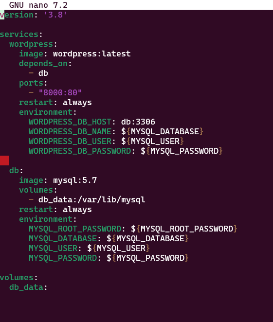
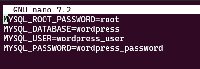
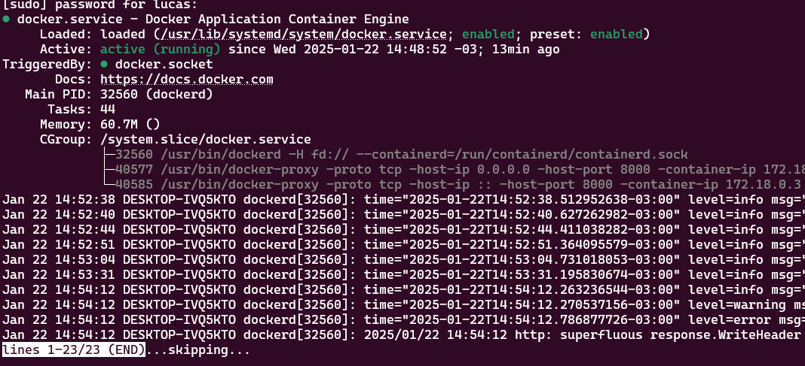
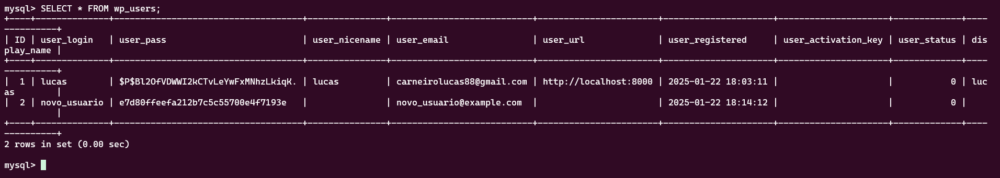
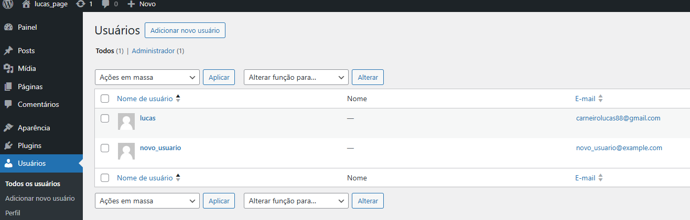

# Configuração do Ambiente WordPress com Docker, MySQL e VS Code (Usando WSL)

Esse projeto configura um ambiente local para desenvolvimento de um site WordPress com banco de dados MySQL, utilizando o Docker para criar contêineres e o WSL (Windows Subsystem for Linux) para facilitar o desenvolvimento no Windows.

## Pré-requisitos

Antes de começar, verifique se você tem as seguintes ferramentas instaladas:

- **Docker**: Para criar e gerenciar os contêineres.
- **VS Code**: Para edição de código.
- **WSL (Windows Subsystem for Linux)**: Para criar um ambiente Linux dentro do Windows.
- **Git**: Para controle de versão.


Instalação do Docker
Instale o Docker Desktop para Windows, que vem com suporte nativo para WSL.

Durante a instalação, o Docker irá configurar automaticamente o WSL para rodar containers Linux.

No VS Code, instale a extensão Remote - WSL para poder editar e trabalhar diretamente dentro do seu ambiente WSL.


## 1. Criando o Projeto no Docker


Criar o diretório do projeto
No WSL, crie um diretório para o projeto e acesse-o:


   ```bash
   mkdir meu-projeto-wordpress
   ```

 ```bash
  cd meu-projeto-wordpress
   ```


Criar o arquivo docker-compose.yml
O arquivo docker-compose.yml define os contêineres para o WordPress e MySQL. Crie esse arquivo no diretório do projeto com o seguinte conteúdo:




O arquivo .env é usado em projetos para armazenar variáveis de ambiente. Ele é especialmente útil para manter informações sensíveis, como senhas, chaves de API e configurações específicas do ambiente, fora do código-fonte principal.




Esse arquivo configura dois serviços: o WordPress e o MySQL. O WordPress será acessível na porta 8000, enquanto o MySQL usará a porta 3306.

Rodar os contêineres
Com o arquivo docker-compose.yml configurado, basta rodar o comando para iniciar os contêineres:


   ```bash
  docker-compose up -d
   ```

Esse comando irá baixar as imagens do WordPress e MySQL e criar os contêineres necessários.



## 2. Acessando o WordPress
Após iniciar os contêineres, abra o navegador e acesse:


http://localhost:8000


Você verá a tela de instalação do WordPress. Complete a instalação fornecendo o nome do site, o nome de usuário, a senha e o e-mail.

4. Acessando o Banco de Dados MySQL
Acessando o MySQL via Docker
No terminal, execute o seguinte comando para acessar o MySQL dentro do contêiner:

   ```bash
    docker exec -it meu-projeto-wordpress_db_1 mysql -u root -p
   ```


Quando solicitado, digite a senha que foi configurada (senha).

Visualizando Bancos de Dados
Após acessar o MySQL, você pode listar os bancos de dados com o comando:

  ```bash
   
    SHOW DATABASES;
   ```

Isso mostrará os bancos de dados disponíveis, incluindo o banco de dados do WordPress (wordpress).

Interagindo com o WordPress no Banco de Dados
Você pode executar comandos SQL para adicionar ou modificar dados no banco de dados do WordPress. Por exemplo, para inserir um novo usuário no WordPress, use o seguinte comando SQL:

 ```bash
   
    INSERT INTO wp_users (user_login, user_pass, user_email, user_registered)
VALUES ('novo_usuario', MD5('senha123'), 'novo_usuario@example.com', NOW());
   ```






